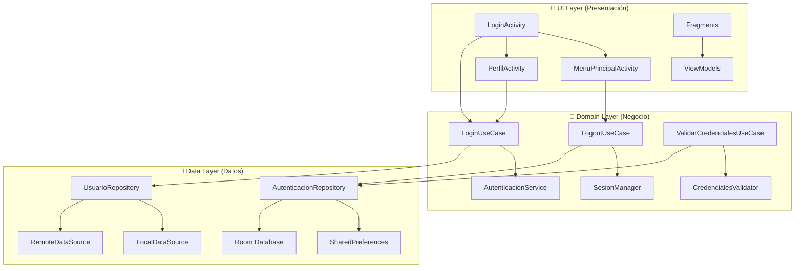

# loginapp
# 🏗️ Arquitectura del Sistema de Login Android

## 📂 Estructura de Carpetas del Proyecto

```
app/
├── src/
│   ├── main/
│   │   ├── java/com/empresa/loginapp/
│   │   │   ├── 📱 ui/                     # Capa de Presentación
│   │   │   │   ├── activities/
│   │   │   │   │   ├── LoginActivity.kt
│   │   │   │   │   ├── MenuPrincipalActivity.kt
│   │   │   │   │   └── PerfilActivity.kt
│   │   │   │   ├── fragments/
│   │   │   │   │   └── (fragmentos futuros)
│   │   │   │   └── adapters/
│   │   │   │       └── (adaptadores futuros)
│   │   │   │
│   │   │   ├── 🔧 data/                   # Capa de Datos
│   │   │   │   ├── models/
│   │   │   │   │   ├── Usuario.kt
│   │   │   │   │   ├── ResultadoAutenticacion.kt
│   │   │   │   │   └── SesionUsuario.kt
│   │   │   │   ├── repository/
│   │   │   │   │   ├── UsuarioRepository.kt
│   │   │   │   │   └── AutenticacionRepository.kt
│   │   │   │   ├── datasource/
│   │   │   │   │   ├── LocalDataSource.kt
│   │   │   │   │   └── RemoteDataSource.kt (futuro)
│   │   │   │   └── database/
│   │   │   │       ├── AppDatabase.kt (futuro)
│   │   │   │       └── dao/ (futuro)
│   │   │   │
│   │   │   ├── 💼 domain/                 # Capa de Dominio/Negocio
│   │   │   │   ├── usecases/
│   │   │   │   │   ├── LoginUseCase.kt
│   │   │   │   │   ├── LogoutUseCase.kt
│   │   │   │   │   └── ValidarCredencialesUseCase.kt
│   │   │   │   ├── services/
│   │   │   │   │   ├── AutenticacionService.kt
│   │   │   │   │   └── SesionManager.kt
│   │   │   │   └── validators/
│   │   │   │       └── CredencialesValidator.kt
│   │   │   │
│   │   │   ├── 🛠️ utils/                  # Utilidades
│   │   │   │   ├── Constants.kt
│   │   │   │   ├── Extensions.kt
│   │   │   │   ├── DateUtils.kt
│   │   │   │   └── SecurityUtils.kt
│   │   │   │
│   │   │   ├── 🔧 di/                     # Inyección de Dependencias
│   │   │   │   ├── AppModule.kt
│   │   │   │   ├── DatabaseModule.kt
│   │   │   │   └── RepositoryModule.kt
│   │   │   │
│   │   │   └── 🚀 MyApplication.kt        # Aplicación base
│   │   │
│   │   ├── res/
│   │   │   ├── layout/                    # Layouts XML
│   │   │   │   ├── activity_login.xml
│   │   │   │   ├── activity_menu_principal.xml
│   │   │   │   ├── activity_perfil.xml
│   │   │   │   └── item_usuario.xml
│   │   │   ├── values/                    # Recursos
│   │   │   │   ├── colors.xml
│   │   │   │   ├── strings.xml
│   │   │   │   ├── styles.xml
│   │   │   │   └── dimens.xml
│   │   │   ├── drawable/                  # Iconos y recursos gráficos
│   │   │   │   ├── ic_lock.xml
│   │   │   │   ├── ic_user.xml
│   │   │   │   └── rounded_background.xml
│   │   │   └── menu/                      # Menús XML
│   │   │       └── menu_principal.xml
│   │   │
│   │   └── AndroidManifest.xml
│   │
│   └── test/                              # Tests unitarios
│       └── java/com/empresa/loginapp/
│           ├── AutenticacionServiceTest.kt
│           ├── LoginUseCaseTest.kt
│           └── CredencialesValidatorTest.kt
│
├── build.gradle.kts
└── proguard-rules.pro
```

## 🏛️ Arquitectura en Capas (Clean Architecture)



## 🔄 Flujo de Datos y Navegación

### 1. **Flujo de Login**
```
LoginActivity
    ↓ (usuario ingresa credenciales)
onClick() en LoginActivity
    ↓ (valida campos)
LoginUseCase.ejecutar()
    ↓ (aplica reglas de negocio)
AutenticacionService.autenticar()
    ↓ (consulta datos)
UsuarioRepository.buscarUsuario()
    ↓ (accede a datos locales)
LocalDataSource.obtenerUsuarios()
    ↓ (resultado)
ResultadoAutenticacion.Exitoso/Error
    ↓ (actualiza UI)
Intent → MenuPrincipalActivity
```

### 2. **Flujo de Sesión**
```
SesionManager.iniciarSesion()
    ↓ (guarda datos de sesión)
SharedPreferences.guardar()
    ↓ (mantiene estado)
SesionUsuario.actual
    ↓ (disponible en toda la app)
Cualquier Activity puede consultar
```

## 📋 Responsabilidades por Capa

### 🎨 **UI Layer (Capa de Presentación)**
```kotlin
// Responsabilidades:
- Mostrar datos al usuario
- Capturar interacciones del usuario
- Navegación entre pantallas
- Manejo de estados de UI (loading, error, success)
- Formateo de datos para mostrar

// Componentes:
- Activities
- Fragments  
- ViewModels (futuro)
- Adapters
- Custom Views
```

### 💼 **Domain Layer (Capa de Dominio)**
```kotlin
// Responsabilidades:
- Lógica de negocio pura
- Casos de uso de la aplicación
- Validaciones de reglas de negocio
- Orquestación entre repositories
- Independiente de frameworks

// Componentes:
- Use Cases
- Services
- Validators
- Business Models
- Interfaces de Repository
```

### 🔧 **Data Layer (Capa de Datos)**
```kotlin
// Responsabilidades:
- Acceso a datos (local/remoto)
- Implementación de repositories
- Caché de datos
- Transformación de datos
- Manejo de fuentes de datos

// Componentes:
- Repositories (implementación)
- Data Sources
- Database entities
- Network models
- SharedPreferences managers
```

## 🔌 Comunicación entre Capas

### **Reglas de Dependencia**
```
UI Layer
    ↓ (puede usar)
Domain Layer
    ↓ (puede usar)
Data Layer
    ↑ (NO puede usar)
UI Layer (❌ Prohibido)
```

### **Interfaces y Contratos**
```kotlin
// En Domain Layer
interface UsuarioRepository {
    suspend fun autenticarUsuario(usuario: String, password: String): ResultadoAutenticacion
    suspend fun obtenerUsuarios(): List<Usuario>
}

// En Data Layer  
class UsuarioRepositoryImpl : UsuarioRepository {
    override suspend fun autenticarUsuario(usuario: String, password: String): ResultadoAutenticacion {
        // Implementación específica
    }
}
```

## 📊 Gestión de Estado

### **Estados de la Aplicación**
```kotlin
sealed class EstadoLogin {
    object Inicial : EstadoLogin()
    object Cargando : EstadoLogin()
    data class Exitoso(val usuario: Usuario) : EstadoLogin()
    data class Error(val mensaje: String) : EstadoLogin()
    object Bloqueado : EstadoLogin()
}

sealed class EstadoSesion {
    object SinSesion : EstadoSesion()
    data class ConSesion(val usuario: Usuario) : EstadoSesion()
    object Expirada : EstadoSesion()
}
```

## 🔧 Configuración y Dependencias

### **build.gradle.kts (app)**
```kotlin
dependencies {
    // UI
    implementation("androidx.appcompat:appcompat:1.6.1")
    implementation("com.google.android.material:material:1.9.0")
    implementation("androidx.constraintlayout:constraintlayout:2.1.4")
    
    // Architecture Components
    implementation("androidx.lifecycle:lifecycle-viewmodel-ktx:2.6.1")
    implementation("androidx.lifecycle:lifecycle-livedata-ktx:2.6.1")
    
    // Navigation (futuro)
    implementation("androidx.navigation:navigation-fragment-ktx:2.6.0")
    implementation("androidx.navigation:navigation-ui-ktx:2.6.0")
    
    // Database (futuro)
    implementation("androidx.room:room-runtime:2.5.0")
    implementation("androidx.room:room-ktx:2.5.0")
    kapt("androidx.room:room-compiler:2.5.0")
    
    // Dependency Injection (futuro)
    implementation("com.google.dagger:hilt-android:2.44")
    kapt("com.google.dagger:hilt-compiler:2.44")
    
    // Testing
    testImplementation("junit:junit:4.13.2")
    testImplementation("org.mockito:mockito-core:4.6.1")
    androidTestImplementation("androidx.test.ext:junit:1.1.5")
}
```

## 🎯 Ventajas de esta Arquitectura

✅ **Separación de responsabilidades** - Cada capa tiene un propósito específico  
✅ **Testeable** - Lógica de negocio independiente de Android  
✅ **Mantenible** - Cambios en una capa no afectan otras  
✅ **Escalable** - Fácil agregar nuevas funcionalidades  
✅ **Reutilizable** - Componentes pueden reutilizarse  
✅ **SOLID principles** - Sigue principios de buena programación  

## 🔄 Evolución Futura

### **Fase 1 (Actual)**
- Activities básicas
- Lógica en Services
- Datos en memoria

### **Fase 2 (Próxima)**
- ViewModels + LiveData
- Room Database
- Navigation Component

### **Fase 3 (Avanzada)**
- Hilt (Dependency Injection)
- Retrofit (API REST)
- Jetpack Compose (UI moderna)

Esta arquitectura te permite empezar simple y evolucionar gradualmente sin reescribir todo el código.
